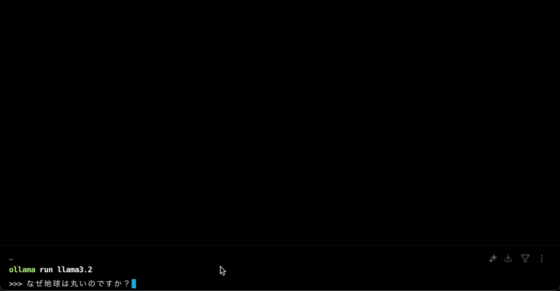

# Ollama Playground

Ollamaは、ローカル環境で大規模言語モデル(LLM)を簡単に実行できるオープンソースのツールです。

https://github.com/ollama/ollama

## Ollamaの使い方

### セットアップ

下記リンクからOllamaをダウンロードしてください。

https://ollama.com/download

ターミナルで`ollama`コマンドが使用できることを確認してください。

```sh
ollama -v
```

### モデルをダウンロードする

ダウンロード可能なモデルは、下記サイトから確認できます。

https://ollama.com/search

ここでは、Meta社が提供するllama3.2をダウンロードしてみます。

https://ollama.com/library/llama3.2

```sh
ollama pull llama3.2
```

以下コマンドを実行すると、ダウンロード済みのモデル一覧を確認できます。

```sh
ollama list
```

以下コマンドを実行すると、モデルを利用できます。

```sh
ollama use llama3.2
```



## Open WebUIで実行する

```sh
docker run -d -p 3000:8080 -e OLLAMA_BASE_URL=http://host.docker.internal:11434 -v open-webui:/app/backend/data --name open-webui --restart always ghcr.io/open-webui/open-webui:main
```

http://localhost:3000 にアクセスするとサインアップが要求される。


認証後は、GUIでローカルLLMを実行できるようになります。


## プロジェクトのセットアップ

本プロジェクトは、[Ollama JavaScript Library](https://github.com/ollama/ollama-js)を用いて、OllamaのAPIを実行するサンプルです。

Nodeバージョンは必ず23.xで実行してください。

### [補足] direnvでNodeバージョンを指定する

direnvのセットアップが完了していない場合は、 https://direnv.net/ を参考する。

`.envrc.local` を作成する。以下は、[mise](https://mise.jdx.dev/)のNodeのバージョンを指定する場合である。

```sh
export MISE_NODE_VERSION=$(jq -r .engines.node ./package.json)
```

### スクリプトを実行する

```sh
npm install
node src/main.ts
```

## Docker Onlyで始める場合

```sh
docker compose up -d
```

適当なmodelをpullします。

```sh
docker compose exec ollama ollama pull llama3.2
```

http://localhost:3000 にアクセスすると、GUIでローカルLLMを実行できるようになります。

## ワークアラウンド

Ollama.app経由で起動した場合、ollamaサーバーをkillできない問題があるので、下記コマンドでOllama.appを終了させる必要があります。

```sh
osascript -e 'tell app "Ollama" to quit'
```

参考: https://github.com/ollama/ollama/issues/2372
