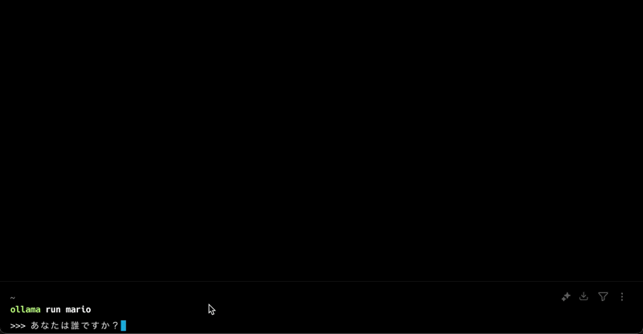

# Custom Model

## llama3.2 Japanese

```sh
ollama create llama3.2-jp -f ./llama3.2-jp/Modelfile
ollama run llama3.2-jp
```

## DeepSeek R1 Japanese

```sh
ollama create deepseek-r1-jp -f ./deepseek-r1-jp/Modelfile
ollama run deepseek-r1-jp
```

### 参考: モデルファイルの作成

```sh
mkdir deepseek-r1-jp
ollama show deepseek-r1 --modelfile > ./deepseek-r1-jp/Modelfile
```

## マリオLLM

```sh
ollama create mario -f ./mario/Modelfile
ollama run mario
```


